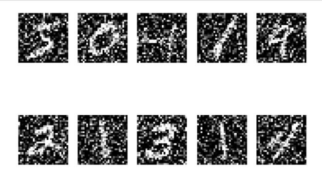
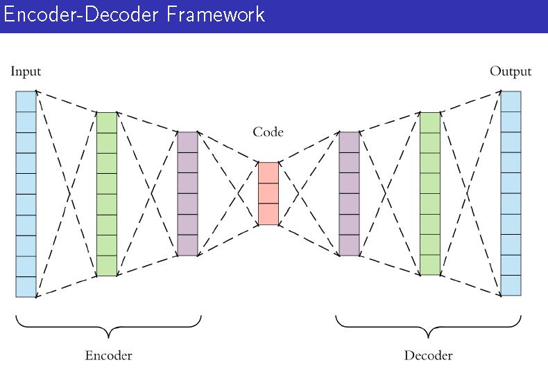
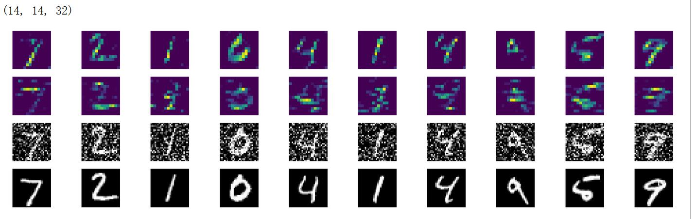

# 使用卷积神经网络搭建去噪编码器——以Mnist数据集为例
## 实验目的：训练一个自编码器，要求能够在有噪音的影响下还原图像，并且获得网络对输入图像的编码，作为输入图像的表征向量
    程序流程：1.获取MNIST数据，然后对训练和测试数据进行归一化和reshape
    2.给数据添加噪音作为网络的输入
```python
#添加噪音
noise_facter=0.5
X_train_noise=X_train+noise_facter*np.random.normal(loc=0.0,scale=1.0,size=X_train.shape) #添加高斯白噪音变化范围为noise_facter*(0-1) 
X_test_noise=X_test+noise_facter*np.random.normal(loc=0.0,scale=1.0,size=X_test.shape)
X_train_noise=np.clip(X_train_noise,0.0,1.0) #将值限制在0 1范围内，超过了这个范围就强制设置为边界值
X_test_noise=np.clip(X_test_noise,0.0,1.0)
```
    可视化添加结果：
    


    3.构建网络，网络结构如下：


```python
#构建网络
from keras.layers import Input,Dense,Conv2D,MaxPooling2D,UpSampling2D
from keras.models import Model,load_model
input_img=Input(shape=(28,28,1))
x=Conv2D(32,(3,3),padding='same',activation='relu')(input_img)#outputSize=28x28x32
x=MaxPooling2D(padding='same')(x)#outsiez=14x14x32
x=Conv2D(32,(3,3),padding='same',activation='relu')(x)#outsize=14x14x32
encoder=MaxPooling2D(padding='same')(x)#outsize=7x7x32

x=Conv2D(32,(3,3),padding='same',activation='relu')(encoder)#7x7x32
x=UpSampling2D()(x)#14x14x32
x=Conv2D(32,(3,3),padding='same',activation='relu')(x)#14x14x32
x=UpSampling2D()(x)#outsiz=28x28x32
decoder=Conv2D(1,(3,3),padding='same',activation='sigmoid')(x)#outsize=28x28x1

autoencoder=Model(input_img,decoder)
autoencoder.compile(optimizer='adadelta', loss='binary_crossentropy')
```
     4.验证去噪与重建效果
```python
del autoencoder
autoencoder=load_model('autoencoder.h5')
decode_imgs=autoencoder.predict(X_test_noise)
plt.figure(figsize=(20,4))
for i in range(10):    
    plt.subplot(3,10,i+1)
    plt.imshow(X_test_noise[i].reshape(28,28),cmap='gray')
    plt.axis('off')
    plt.subplot(3,10,i+10+1)
    plt.imshow(decode_imgs[i].reshape(28,28),cmap='gray')
    plt.axis('off')
    plt.subplot(3,10,i+2*10+1)
    plt.imshow(X_test[i].reshape(28,28),cmap='gray')
    plt.axis('off')
```

    第一行为添加了噪音的输入图像
    第二行是网络重建出来了的图像
    第三行是没有添加噪音的原始图像    


    5.提取图像的表征向量

```python
#提取特征表征向量
from keras import backend as k
getCode=k.function([autoencoder.layers[0].input],
                  [autoencoder.layers[3].output])
code=getCode([X_test_noise])[0]
print(code[0].shape)
plt.figure(figsize=(30,8))
for i in range(10):
    plt.subplot(4,10,i+1)
    plt.imshow(code[i][:,:,0])
    plt.axis('off')
    
    plt.subplot(4,10,i+1+10)
    plt.imshow(code[i][:,:,1])
    plt.axis('off')
    
    plt.subplot(4,10,i+1+10*2)
    plt.imshow(X_test_noise[i].reshape(28,28),cmap='gray')
    plt.axis('off')
    
    plt.subplot(4,10,i+1+10*3)
    plt.imshow(X_test[i].reshape(28,28),cmap='gray')
    plt.axis('off')
```


